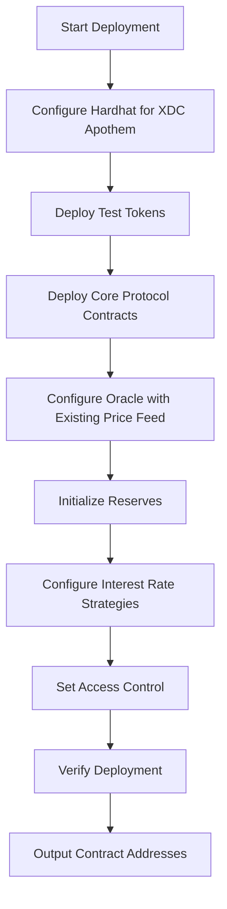

# Design Document: AAVE v3 Deployment on XDC Network Apothem

## Overview

This design outlines the deployment architecture for AAVE v3 protocol on XDC Network Apothem testnet. The deployment leverages the existing AAVE v3 deployment infrastructure (@aave/deploy-v3) while adding XDC-specific configuration and custom test tokens. The deployment will be executed through Hardhat with custom network configuration and deployment scripts.

### Key Design Decisions

1. **Leverage Existing Infrastructure**: Use @aave/deploy-v3 package for core deployment logic to maintain consistency with official AAVE deployments
2. **Custom Network Configuration**: Add XDC Apothem as a new network in Hardhat configuration
3. **Test Token Integration**: Deploy custom Test_USDT and Test_WXDC contracts compatible with AAVE v3
4. **Price Oracle Configuration**: Integrate existing XDC/USDT price feed for accurate asset valuation
5. **Minimal Modifications**: Keep changes isolated to configuration files and deployment scripts to maintain upgradeability

## Architecture

### Deployment Flow



### Contract Deployment Order

1. **Test Tokens** (Test_USDT, Test_WXDC)
2. **PoolAddressesProvider** - Central registry for protocol addresses
3. **ACLManager** - Access control for protocol operations
4. **AaveOracle** - Price oracle aggregator
5. **Pool** - Main lending pool contract
6. **PoolConfigurator** - Configuration management
7. **Token Implementations** (AToken, StableDebtToken, VariableDebtToken)
8. **Interest Rate Strategies** - Per-asset interest rate models
9. **Reserve Initialization** - Configure USDT and WXDC as reserves
10. **AaveProtocolDataProvider** - Data query helper

## Components and Interfaces

### 1. Network Configuration

**File**: `hardhat.config.ts`

Add XDC Apothem network configuration:

```typescript
networks: {
  xdcApothem: {
    url: 'https://erpc.apothem.network',
    chainId: 51,
    accounts: [process.env.XDC_PRIVATE_KEY],
    gasPrice: 'auto',
    gas: 'auto',
  }
}
```

**File**: `helper-hardhat-config.ts`

Extend network types and RPC URLs:

```typescript
export enum eXDCNetwork {
  apothem = 'xdcApothem',
}

export const NETWORKS_RPC_URL = {
  ...existing,
  [eXDCNetwork.apothem]: 'https://erpc.apothem.network',
}
```

### 2. Test Token Contracts

**Contracts**: `XDC/Test_USDT.sol`, `XDC/Test_WXDC.sol`

These contracts are already implemented with:
- ERC20 standard compliance
- 6 decimal precision
- Ownable for controlled minting
- Airdrop functionality for testing

**Deployment Strategy**:
- Deploy both contracts early in the deployment process
- Mint initial supply to deployer address
- Use addresses as reserve assets in pool configuration

### 3. Deployment Scripts

**File**: `scripts/deploy-xdc-apothem.ts` (new)

Main deployment orchestration script that:
- Deploys test tokens
- Calls @aave/deploy-v3 deployment functions
- Configures XDC-specific parameters
- Initializes reserves with test tokens
- Outputs deployment summary

**File**: `markets/xdc/index.ts` (new)

Market configuration for XDC Apothem:
- Reserve configurations (LTV, liquidation threshold, etc.)
- Interest rate strategy parameters
- Oracle asset configurations
- Protocol fee settings

### 4. Oracle Configuration

**Component**: AaveOracle

The oracle will use the existing XDC/USDT price feed deployed at `0x7D276a421fa99B0E86aC3B5c47205987De76B497`. This feed will be configured directly in the AaveOracle contract without deploying additional price feed contracts.

**Configuration**:
```typescript
{
  USDT: {
    feed: '0x7D276a421fa99B0E86aC3B5c47205987De76B497',
    decimals: 8, // Standard Chainlink decimals
  },
  WXDC: {
    feed: '0x7D276a421fa99B0E86aC3B5c47205987De76B497', // Same feed, inverse calculation
    decimals: 8,
  }
}
```

**Note**: The existing price feed provides XDC/USDT pricing, which will be used for both assets with appropriate calculations.

### 5. Reserve Configuration

**Assets**: USDT, WXDC

**Parameters** (Conservative testnet values):
- **USDT**:
  - LTV: 75%
  - Liquidation Threshold: 80%
  - Liquidation Bonus: 5%
  - Reserve Factor: 10%
  - Borrow Enabled: Yes
  - Stable Borrow Enabled: Yes

- **WXDC**:
  - LTV: 70%
  - Liquidation Threshold: 75%
  - Liquidation Bonus: 7%
  - Reserve Factor: 10%
  - Borrow Enabled: Yes
  - Stable Borrow Enabled: No

### 6. Interest Rate Strategy

**Model**: DefaultReserveInterestRateStrategy

**Parameters** (per asset):
- Base Variable Borrow Rate: 0%
- Variable Rate Slope 1: 4%
- Variable Rate Slope 2: 75%
- Stable Rate Slope 1: 2%
- Stable Rate Slope 2: 75%
- Optimal Utilization: 80%

## Data Models

### Deployment Configuration

```typescript
interface XDCDeploymentConfig {
  network: {
    name: string;
    chainId: number;
    rpc: string;
    privateKey: string;
  };
  tokens: {
    usdt: {
      address?: string;
      deploy: boolean;
    };
    wxdc: {
      address?: string;
      deploy: boolean;
    };
  };
  oracle: {
    xdcUsdtFeed: string;
  };
  reserves: {
    [asset: string]: ReserveConfig;
  };
}

interface ReserveConfig {
  baseLTVAsCollateral: string;
  liquidationThreshold: string;
  liquidationBonus: string;
  reserveFactor: string;
  borrowingEnabled: boolean;
  stableBorrowRateEnabled: boolean;
  interestRateStrategy: InterestRateStrategyParams;
}
```

### Deployment Output

```typescript
interface DeploymentOutput {
  network: string;
  chainId: number;
  timestamp: number;
  deployer: string;
  contracts: {
    testTokens: {
      USDT: string;
      WXDC: string;
    };
    core: {
      PoolAddressesProvider: string;
      Pool: string;
      PoolConfigurator: string;
      ACLManager: string;
      AaveOracle: string;
      ProtocolDataProvider: string;
    };
    tokens: {
      AToken: string;
      StableDebtToken: string;
      VariableDebtToken: string;
    };
    reserves: {
      [asset: string]: {
        aToken: string;
        stableDebtToken: string;
        variableDebtToken: string;
        interestRateStrategy: string;
      };
    };
  };
}
```

## Error Handling

### Deployment Failures

1. **Network Connection Issues**
   - Retry logic with exponential backoff
   - Clear error messages indicating RPC connectivity problems
   - Fallback to alternative RPC endpoints if available

2. **Transaction Failures**
   - Gas estimation failures: Increase gas limit by 20%
   - Nonce issues: Fetch latest nonce before each transaction
   - Revert reasons: Parse and display contract revert messages

3. **Contract Verification Failures**
   - Log deployment addresses even if verification fails
   - Provide manual verification instructions
   - Save constructor arguments for later verification

### Configuration Errors

1. **Missing Environment Variables**
   - Validate all required env vars before deployment
   - Provide clear error messages with required variable names
   - Example .env template in documentation

2. **Invalid Parameters**
   - Validate reserve configurations before deployment
   - Check oracle feed addresses are valid contracts
   - Ensure interest rate parameters are within acceptable ranges

### Recovery Mechanisms

1. **Partial Deployment Recovery**
   - Save deployment state after each major step
   - Allow resuming from last successful deployment
   - Skip already-deployed contracts

2. **Rollback Strategy**
   - Document deployed contract addresses
   - Provide cleanup scripts for failed deployments
   - Clear instructions for redeployment

## Testing Strategy

### Pre-Deployment Testing

1. **Local Hardhat Testing**
   - Run existing AAVE v3 test suite
   - Verify no regressions from configuration changes
   - Test custom token contracts

2. **Fork Testing**
   - Fork XDC Apothem network
   - Test deployment scripts on fork
   - Validate all contract interactions

### Post-Deployment Testing

1. **Contract Verification**
   - Verify all contracts are deployed at expected addresses
   - Check contract initialization states
   - Validate access control configurations

2. **Functional Testing**
   - Test token minting and transfers
   - Verify oracle price feeds
   - Test basic pool operations (supply, borrow, repay, withdraw)

3. **Integration Testing**
   - Test complete user flows
   - Verify liquidation mechanisms
   - Test interest accrual

### Test Scenarios

1. **Supply and Borrow Flow**
   - User supplies USDT
   - User borrows WXDC against USDT collateral
   - Verify interest accrual
   - User repays WXDC
   - User withdraws USDT

2. **Liquidation Flow**
   - User supplies collateral
   - User borrows to near liquidation threshold
   - Simulate price change
   - Liquidator liquidates position
   - Verify liquidation bonus distribution

3. **Oracle Failure Handling**
   - Simulate oracle price feed failure
   - Verify fallback mechanisms
   - Test protocol pause if necessary

## Deployment Checklist

### Pre-Deployment
- [ ] Environment variables configured (.env file)
- [ ] XDC Apothem RPC endpoint accessible
- [ ] Deployer account has sufficient XDC for gas
- [ ] Test token contracts compiled
- [ ] Market configuration reviewed

### Deployment
- [ ] Deploy test tokens (USDT, WXDC)
- [ ] Deploy PoolAddressesProvider
- [ ] Deploy ACLManager
- [ ] Deploy AaveOracle
- [ ] Configure oracle price feeds
- [ ] Deploy Pool
- [ ] Deploy PoolConfigurator
- [ ] Deploy token implementations
- [ ] Deploy interest rate strategies
- [ ] Initialize reserves
- [ ] Configure reserve parameters
- [ ] Set access control roles

### Post-Deployment
- [ ] Verify all contract addresses
- [ ] Test basic pool operations
- [ ] Document deployment addresses
- [ ] Verify contracts on block explorer (if available)
- [ ] Create deployment summary report

## Security Considerations

1. **Private Key Management**
   - Use environment variables for private keys
   - Never commit private keys to version control
   - Consider using hardware wallet for mainnet deployments

2. **Access Control**
   - Set appropriate admin roles
   - Use multi-sig for critical operations (production)
   - Document all privileged addresses

3. **Oracle Security**
   - Validate price feed addresses
   - Implement price deviation checks
   - Set up monitoring for oracle failures

4. **Parameter Validation**
   - Ensure LTV < Liquidation Threshold
   - Validate interest rate parameters are reasonable
   - Check reserve factors are within acceptable ranges

## Monitoring and Maintenance

1. **Deployment Monitoring**
   - Log all transaction hashes
   - Monitor gas usage
   - Track deployment duration

2. **Post-Deployment Monitoring**
   - Monitor oracle price updates
   - Track pool utilization
   - Monitor interest rate changes
   - Alert on unusual activity

3. **Maintenance Tasks**
   - Regular parameter reviews
   - Oracle feed updates if needed
   - Protocol upgrades (if applicable)
   - Reserve additions/modifications
